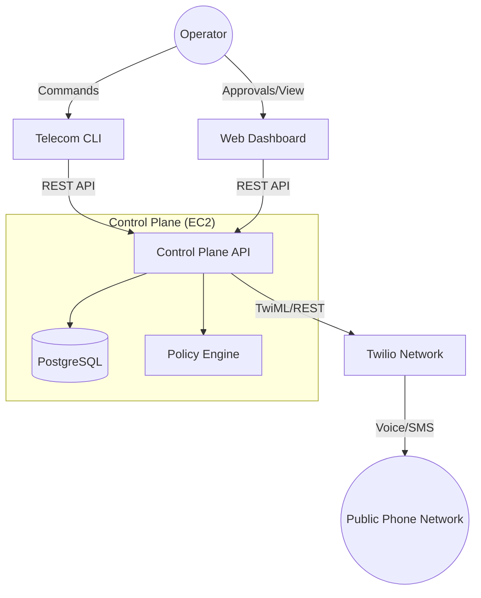

<div align="center">
  <h1>📡 Telecom-as-Code Control Plane</h1>
  <p><strong>Infrastructure-as-Code for Voice & SMS | Human-in-the-Loop Safety | Real-Time Visibility</strong></p>
</div>

---

## 📖 Overview

The **Telecom Control Plane** is a modern operations platform that brings **DevOps principles** to telephony. Instead of clicking through provider consoles (like Twilio) or managing state in spreadsheets, you manage your telecom infrastructure using **Code (CLI)** and a **Real-Time Dashboard**.

It introduces a **Safety Layer** between your operators and the carrier network, allowing for governance, approvals, and audit trails.

### Key Features

*   **💻 CLI-First Operations**: Initiate calls, send SMS, and manage conferences directly from your terminal.
*   **🛡️ Human-in-the-Loop Approvals**: High-risk actions (like bulk dialing or merging active lines) can be gated by policy, requiring human approval via the dashboard.
*   **📊 Real-Time Observability**: Live view of all active call legs, conferences, and message traffic.
*   **🏢 Multi-Tenant Workspaces**: Isolate configuration and traffic for different teams or environments (Dev/Prod).

### 🌍 Real-World Scenarios
*   **🛑 The "Oops" Button**: A junior dev accidentally runs a script to SMS 5,000 customers. The **Policy Engine** catches the volume spike and pauses the queue. You get a notification, log in, see the mistake, and click **Deny**. Crisis averted.
*   **🎩 The VIP Handoff**: A support agent needs to merge a specialist into a call with a high-value client. The system gates this action, requiring a Supervisor to **Approve** the merge from the dashboard to ensure the specialist is fully prepped before joining.
*   **🔍 Compliance Trails**: Your industry requires a log of *exactly* when calls happen and who authorized them. The Control Plane records every command, approval, and connection event automatically—replacing manual spreadsheets forever.

### 🤖 Agent Integration (Moltbot / OpenClaw)
This Control Plane is designed to be **agent-native**. It exposes a "Tool Interface" that AI agents can use to perform telecom actions safely.

*   **Skill Definition**: Located in [`skills/openclaw-telecom/SKILL.md`](./skills/openclaw-telecom/SKILL.md).
*   **How it works**:
    1.  Install the skill into your Moltbot/OpenClaw agent.
    2.  The Agent can now "Request a Call" (`telecom call dial`).
    3.  **Safety**: The request hits the Policy Engine. If high-risk, it pauses for **Human Approval** in the Dashboard. The Agent waits for the "APPROVED" signal before proceeding.
    4.  **Result**: Agents get superpowers (phone calls) without the risk of accidentally robbing a bank or spamming a country.

---

## 🏗️ Architecture



---

## ✅ Prerequisites

Before you begin, ensure you have:

*   **Node.js 18+** installed locally.
*   A **Twilio Account** with:
    *   **Account SID** and **Auth Token** (for API connection).
    *   A purchased **Phone Number** (for calling/SMS).
*   **Twilio Studio Flow** (Optional, for advanced IVR handling).

---

## 🚀 Quick Start

### 1. Installation
The Control Plane consists of a CLI tool and a centralized API Server.
```bash
# Install the CLI tool globally
npm install -g @telecom/cli
```

### 2. Configuration
Connect to your deployed workspace or local instance:
```bash
telecom onboard
# Follow the interactive wizard to enter your Twilio credentials.
```

### 3. Usage
**Voice Operations**
```bash
# Dial a number
telecom call dial +15550100

# Merge two active calls
telecom call merge CA123... CA456...
```

**Messaging**
```bash
# Send a text
telecom sms send +15550100 "Hello from the Control Plane!"
```

---

## 📚 Documentation & Guides

*   **[Operator Runbook](./RUNBOOK.md)**: Detailed smoke tests and verification steps.
*   **[Deployment Guide](./DEPLOY_FRONTEND.md)**: How to deploy the Dashboard to EC2.
*   **Web Dashboard**: [http://13.61.21.177](http://13.61.21.177) (Production)

---

## 🛡️ License
Private Source - Internal Use Only.
